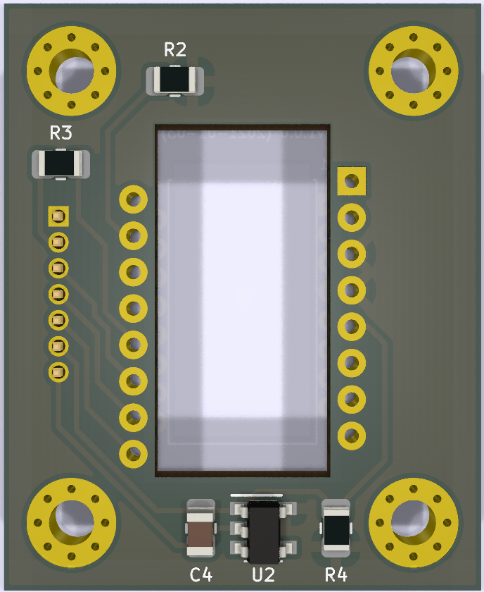

# PMW3360DM-T2QU
PCB schematic and design for the Pixart PMW3360DM-T2QU optical mouse sensor.

## Components
* 1 x [Pixart PMW3360DM-T2QU](https://www.pixart.com/products-detail/10/PMW3360DM-T2QU)
* 1 x [4.7uF/10V](http://uk.farnell.com/multicomp/mctt21f475z100ct/cap-mlcc-y5v-4-7uf-10v-0805-reel/dp/2666292)
* 1 x [1uF](http://uk.farnell.com/walsin/0805b105k100ct/cap-mlcc-x7r-1uf-10v-0805-reel/dp/2495444)
* 1 x [0.1uF](http://uk.farnell.com/walsin/0805b104k500ct/capacitor-mlcc-x7r-0-1uf-50v-0805/dp/2496944RL)
* 3 x [10K Ohm](http://uk.farnell.com/multicomp/mcwr08x1002ftl/res-thick-film-10k-1-0-125w-0805/dp/2447553)
* 1 x [130 Ohm](http://uk.farnell.com/multicomp/mcwr08x1300ftl/res-thick-film-130-ohm-1-0-125w/dp/2447568?ost=2447568)
* 1 x [39 Ohm](http://uk.farnell.com/multicomp/mcwr08x39r0ftl/res-thick-film-39r-1-0-125w-0805/dp/2447647?ost=2447647)
* 1 x [TLV70019DDCT 1.9V LDO](http://uk.farnell.com/texas-instruments/tlv70019ddct/ldo-reg-0-175vdo-0-2a-1-9v-5sot23/dp/2144265)
* 1 x [1x7 1.27mm pin header](https://uk.farnell.com/multicomp/mc-hvt1-s07-g/connector-header-7pos-1row-1-27mm/dp/2852589)
